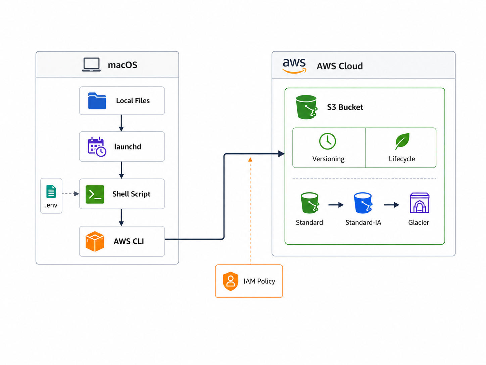

# S3 Backup Automation

macOS上のローカルデータを、AWS CLI・Shell Script・launchdを利用してAmazon S3へ自動バックアップする仕組みです。

単純なファイルアップロードだけではなく、IAMの最小権限、S3 Versioning、Lifecycle Policy、誤削除対策を組み合わせ、**データ保護・セキュリティ・運用性・コスト最適化**を考慮した構成としています。

---

## 概要

本構成では、macOS上の以下のディレクトリをAmazon S3へバックアップします。

* Documents
* Desktop
* Pictures
* Downloads

バックアップ処理はShell Scriptで実装し、macOSの`launchd`を利用して**毎日22:00に自動実行**します。

Amazon S3側では、VersioningとLifecycle Policyを利用してバックアップデータを保護しながら、長期保存時のストレージコストを最適化します。

---

## AWS構成図



構成図の詳細およびMermaid版は以下を参照してください。

* [architecture/architecture.md](./architecture/architecture.md)

---

## 主な機能

* `aws s3 sync`によるAmazon S3へのバックアップ
* Shell Scriptによるバックアップ処理の自動化
* `launchd`による毎日22:00の定期実行
* `.env`による環境依存情報の分離
* IAMの最小権限の原則（Least Privilege）
* S3 Versioningによる過去バージョンの保持
* Lifecycle Policyによるストレージクラスの自動移行
* 非現行バージョンの90日間保持
* `--delete`を使用しない誤削除対策
* `s3:DeleteObject`を付与しないIAM設計
* 標準ログとエラーログの分離

---

## 使用技術

| カテゴリ            | 使用技術                |
| --------------- | ------------------- |
| Cloud           | Amazon Web Services |
| Storage         | Amazon S3           |
| Security        | AWS IAM             |
| CLI             | AWS CLI             |
| Script          | Bash / Shell Script |
| Scheduler       | macOS launchd       |
| Version Control | Git / GitHub        |
| Configuration   | `.env`              |
| Documentation   | Markdown / Mermaid  |

---

## バックアップ処理フロー

```text
Local Files
    │
    ▼
launchd
毎日22:00
    │
    ▼
s3-backup.sh
    │
    ├── .env
    │
    ▼
AWS CLI
aws s3 sync
    │
    ▼
Amazon S3
    │
    ├── Versioning
    ├── Lifecycle Policy
    │
    └── IAM Policy
        Least Privilege
```

処理の流れは以下の通りです。

1. `launchd`が毎日22:00にバックアップ処理を開始
2. `s3-backup.sh`を実行
3. `.env`からS3バケット名・リージョン・AWS CLI Profileを取得
4. `aws s3 sync`を実行
5. IAMの最小権限ポリシーによる認可のもと、Amazon S3へアクセス
6. ローカルデータをAmazon S3へバックアップ
7. S3 Versioningによって過去バージョンを保持
8. Lifecycle Policyによって保存期間に応じてストレージクラスを移行

---

## ディレクトリ構成

```text
s3-backup-automation/
├── README.md
├── LICENSE
├── .gitignore
├── .env.example
│
├── architecture/
│   ├── architecture.md
│   └── s3automationarchitecture.png
│
├── docs/
│   └── s3-storage-design.md
│
├── iam/
│   └── s3-backup-policy.json
│
├── launchd/
│   └── io.github.mahiro0323.s3-backup-automation.plist
├── s3/
│   ├── versioning-configuration.json
│   └── lifecycle-policy.json
│
└── scripts/
    └── s3-backup.sh
```

---

## S3ストレージ設計

S3の詳細なストレージ設計については以下にまとめています。

* [docs/s3-storage-design.md](./docs/s3-storage-design.md)

### S3 Versioning

バックアップ用S3バケットではS3 Versioningを有効化します。

同じオブジェクトが上書きされた場合でも過去バージョンを保持することで、
必要に応じて以前の状態へ復元できる構成としています。

Versioningの設定ファイルは以下です。

- [s3/versioning-configuration.json](./s3/versioning-configuration.json)

設定内容：

```json
{
  "Status": "Enabled"
}
```

AWS CLIからS3 Versioningを有効化する場合は、以下のコマンドを使用します。

```bash
aws s3api put-bucket-versioning \
  --bucket "$S3_BUCKET" \
  --versioning-configuration Status=Enabled \
  --region "$AWS_REGION" \
  --profile "$AWS_PROFILE"
```

AWS CLIでは、`--versioning-configuration Status=Enabled` を指定することで、
対象バケットのVersioningを有効化できます。

Versioningの設定状態は、以下のコマンドで確認できます。

```bash
aws s3api get-bucket-versioning \
  --bucket "$S3_BUCKET" \
  --region "$AWS_REGION" \
  --profile "$AWS_PROFILE"
```

正常に有効化されている場合は、以下のように `Status` が `Enabled` と表示されます。

```json
{
  "Status": "Enabled"
}
```

### Versioningのイメージ

```text
report.pdf
├── Version 1
├── Version 2
└── Version 3 (current)
```

過去バージョンを保持することで、
誤った上書きが発生した場合でも以前の状態へ復元できます。

---
## Lifecycle Policy

バックアップデータは保存期間に応じてストレージクラスを変更します。

| 経過日数    | ストレージクラス                      |
| ------- | ----------------------------- |
| 0〜29日   | S3 Standard                   |
| 30〜179日 | S3 Standard-IA                |
| 180日以降  | S3 Glacier Flexible Retrieval |

Lifecycle Policyの設定ファイルは以下です。

* [s3/lifecycle-policy.json](./s3/lifecycle-policy.json)

最近のデータはすぐアクセスできるS3 Standardに保存し、アクセス頻度が下がることを想定した古いバックアップを低コストなストレージクラスへ移行します。

### 小容量オブジェクトについて

128KB未満のオブジェクトは、S3 Lifecycleのデフォルト動作では
ストレージクラス移行の対象外となります。

本構成では小容量ファイルに対する強制的な移行は行わず、
AWSのデフォルト動作を利用します。

詳細な設計方針は以下を参照してください。

- [docs/s3-storage-design.md](./docs/s3-storage-design.md)


### 未完了Multipart Upload

Lifecycle Policyでは、完了していないMultipart Uploadを
開始から7日後に自動的にAbortする設定としています。

```json
"AbortIncompleteMultipartUpload": {
  "DaysAfterInitiation": 7
}
```

これにより、ネットワーク切断や処理中断などで残った
未完了アップロードのパーツが長期間S3上に残ることを防ぎます。

完了済みのオブジェクトには影響しません。

詳細な設計方針は以下を参照してください。

- [docs/s3-storage-design.md](./docs/s3-storage-design.md)


---

## 非現行バージョン

S3 Versioningによって非現行となったオブジェクトは、90日間保持する設計としています。

```text
Current Version
      │
      │ 上書き
      ▼
Noncurrent Version
      │
      │ 90日間保持
      ▼
Expiration
```

一定期間の復旧可能性を確保しながら、古いバージョンが無期限に蓄積することを防ぎます。

---

## IAM セキュリティ設計

バックアップ処理では、IAMの**最小権限の原則（Least Privilege）**を採用しています。

IAMポリシーはこちらです。

* [iam/s3-backup-policy.json](./iam/s3-backup-policy.json)

バックアップ処理に必要な操作のみを許可し、管理用途の権限は分離しています。

### 主な許可操作

* S3バケット内のオブジェクト一覧取得
* S3バケットのリージョン取得
* S3へのオブジェクトアップロード
* Multipart Uploadに必要な操作

### 意図的に許可していない操作

* S3オブジェクトの削除
* S3バケットの削除
* Lifecycle Policyの変更
* Versioning設定の変更
* Bucket Policyの変更

バックアップ処理用の権限とAWSリソース管理用の権限を分離することで、不要な権限を付与しない構成としています。

---

## 誤削除対策

本構成では、ローカル環境での誤削除がAmazon S3上のバックアップデータへ波及しにくいように、複数の対策を実施しています。

### `--delete`を使用しない

バックアップスクリプトでは以下を利用します。

```bash
aws s3 sync
```

一方で、

```bash
aws s3 sync --delete
```

は使用しません。

そのため、ローカル環境からファイルを削除しても、次回同期時にS3上の対応オブジェクトが自動削除されない構成です。

### `s3:DeleteObject`を付与しない

バックアップ用IAMポリシーには、

```text
s3:DeleteObject
```

を付与していません。

```text
ローカルファイル誤削除
        │
        ▼
バックアップ実行
        │
        ▼
S3上のバックアップを保持
```

`aws s3 sync`とIAMの両方で削除操作を制限することで、誤削除に対する多層的な対策としています。

---

## 環境変数

実際のS3バケット名など、環境依存の情報は`.env`で管理します。

```text
.env
```

`.env`は`.gitignore`によってGitの管理対象から除外しているため、GitHubには公開されません。

GitHubにはサンプルとして以下のみ公開しています。

```text
.env.example
```

設定例：

```bash
S3_BUCKET=your-s3-backup-bucket
AWS_REGION=ap-northeast-1
AWS_PROFILE=default
```

---

## セットアップ

### 1. リポジトリをClone

```bash
git clone https://github.com/mahiro0323/s3-backup-automation.git
```

```bash
cd s3-backup-automation
```

### 2. `.env`を作成

```bash
cp .env.example .env
```

`.env`を編集します。

```bash
nano .env
```

実際の環境に合わせて設定してください。

```bash
S3_BUCKET=your-s3-backup-bucket
AWS_REGION=ap-northeast-1
AWS_PROFILE=default
```

### 3. バックアップスクリプトへ実行権限を付与

```bash
chmod +x scripts/s3-backup.sh
```

### 4. Shell Scriptの構文確認

```bash
bash -n scripts/s3-backup.sh
```

エラーが表示されなければ構文チェック成功です。

---

## 自動実行

macOSの`launchd`を利用して、バックアップ処理を定期実行します。

設定ファイル：

```text
launchd/io.github.mahiro0323.s3-backup-automation.plist
```

実行時刻：

```text
毎日 22:00
```

`launchd`へ登録する前に、plistの構文を確認します。

```bash
plutil -lint launchd/io.github.mahiro0323.s3-backup-automation.plist
```

正常な場合は、以下のように表示されます。

```text
launchd/io.github.mahiro0323.s3-backup-automation.plist: OK
```

### LaunchAgentへの配置

ユーザー用LaunchAgentとして利用するため、
plistを`~/Library/LaunchAgents`へ配置します。

```bash
mkdir -p ~/Library/LaunchAgents
```

```bash
cp launchd/io.github.mahiro0323.s3-backup-automation.plist \
  ~/Library/LaunchAgents/io.github.mahiro0323.s3-backup-automation.plist
```

配置後のファイルを確認します。

```bash
ls -l ~/Library/LaunchAgents/io.github.mahiro0323.s3-backup-automation.plist
```

コピー後のplistについても構文確認を行います。

```bash
plutil -lint ~/Library/LaunchAgents/io.github.mahiro0323.s3-backup-automation.plist
```

### launchdへの登録

以下のコマンドでLaunchAgentを登録します。

```bash
launchctl bootstrap gui/$(id -u) \
  ~/Library/LaunchAgents/io.github.mahiro0323.s3-backup-automation.plist
```

登録状態は以下で確認できます。

```bash
launchctl print gui/$(id -u)/io.github.mahiro0323.s3-backup-automation
```

本構成では`StartCalendarInterval`を利用し、
毎日22:00にバックアップ処理を開始する設定としています。

```text
Hour   : 22
Minute : 0
```

### 手動起動テスト

定期実行を待たずに動作確認する場合は、
以下のコマンドでLaunchAgentを手動起動できます。

```bash
launchctl kickstart -k \
  gui/$(id -u)/io.github.mahiro0323.s3-backup-automation
```

実行状態は以下で確認します。

```bash
launchctl print \
  gui/$(id -u)/io.github.mahiro0323.s3-backup-automation \
  | grep -E "runs|last exit code|state"
```

正常終了した場合は、以下のように終了コード`0`を確認できます。

```text
runs = 1
last exit code = 0
```

### 動作確認結果

手動起動テストでは、`launchd`経由でバックアップスクリプトが正常に実行されることを確認しました。

以下のバックアップ対象について処理完了を確認しています。

```text
Documents
Desktop
Pictures
Downloads
```

また、AWS CLIからAmazon S3を確認し、
各ディレクトリに対応するプレフィックスが作成されていることを確認しました。

```text
Desktop/
Documents/
Downloads/
Pictures/
```

標準ログでは、バックアップ開始から各ディレクトリの処理完了、
バックアップ終了まで正常に記録されることを確認しています。

なお、毎日22:00の`StartCalendarInterval`による自動起動については、
設定値およびLaunchAgentへの登録状態を確認しています。
実行時刻到達後は`runs`の増加とログを確認することで定期実行を検証できます。

### LaunchAgentの登録解除

設定変更や検証のためにLaunchAgentを登録解除する場合は、
以下のコマンドを使用します。

```bash
launchctl bootout gui/$(id -u) \
  ~/Library/LaunchAgents/io.github.mahiro0323.s3-backup-automation.plist
```

環境によってリポジトリの配置場所が異なるため、
plist内のスクリプトパスは実際の環境に合わせて調整してください。

---
## ログ

`launchd`実行時のログは、標準出力とエラー出力を分離しています。

### 標準ログ

```text
/tmp/s3-backup-automation.log
```

### エラーログ

```text
/tmp/s3-backup-automation-error.log
```

障害発生時にはエラーログを確認することで、原因調査を行いやすい構成としています。

---

## 動作確認

構築時には以下の確認を実施しています。

* AWS CLIのインストール確認
* AWS CLIによるAWS認証確認
* 対象S3バケットへのアクセス確認
* テストファイルを利用した`aws s3 sync --dryrun`
* テストファイルのS3アップロード
* AWS CLIからS3上のオブジェクト存在確認
* `.env`がGitの管理対象から除外されていることを確認
* Shell Scriptの構文確認
* `launchd` plistの構文確認
* Lifecycle Policy JSONの構文確認
* IAM Policy JSONの構文確認

---

## 設計上のポイント

本構成では、単にローカルファイルをAmazon S3へアップロードするだけではなく、以下を意識して設計しています。

### データ保護

S3 Versioningによって過去バージョンを保持します。

### セキュリティ

IAMの最小権限を適用し、バックアップ処理に不要な管理権限を付与しません。

### 誤削除対策

`--delete`および`s3:DeleteObject`を使用しないことで、削除操作を制限します。

### コスト最適化

Lifecycle Policyによって古いバックアップデータを低コストなストレージクラスへ移行します。

### 運用性

`launchd`による自動実行とログ分離により、日常運用と障害調査を行いやすい構成としています。

### 機密情報の分離

`.env`と`.env.example`を使い分け、実環境固有の情報をGitHubへ公開しない構成としています。

---

## 今後の改善

今後は以下の機能追加を検討しています。

* バックアップ成功・失敗時の通知
* バックアップ結果の監視
* エラー発生時のリトライ処理
* バックアップ対象ディレクトリの設定ファイル化
* IaCによるS3・IAM設定の自動構築
* テスト自動化
* ログローテーション
* 復元手順のドキュメント化

---

## License

This project is licensed under the MIT License.

