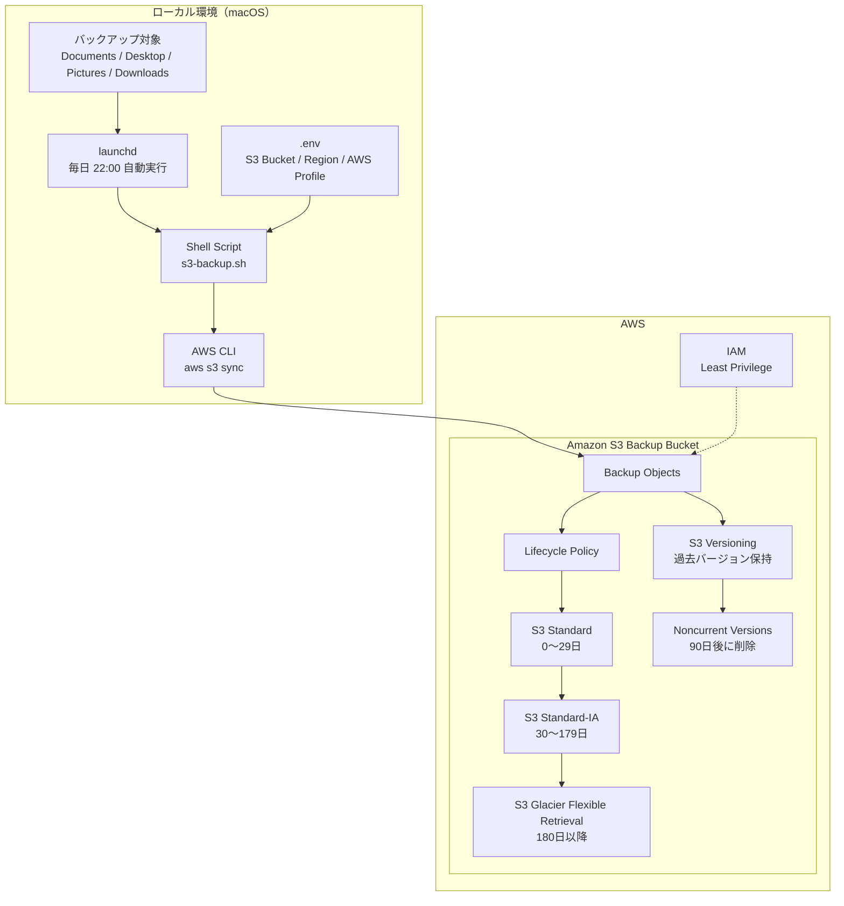
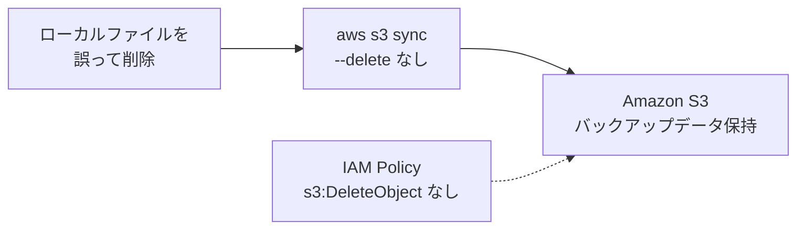
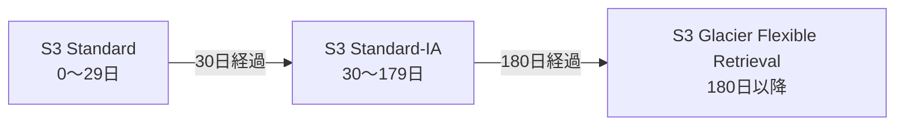

# S3 Backup Automation 構成図

## AWS構成図

## システム構成

## バックアップ処理フロー

1. `launchd` が毎日22:00にバックアップ処理を開始
2. `s3-backup.sh` が `.env` から環境設定を取得
3. AWS CLIの `aws s3 sync` を実行
4. IAMの最小権限ポリシーによる認可のもと、Amazon S3へアクセス
5. ローカルデータをAmazon S3へバックアップ
6. S3 Versioningによって過去バージョンを保持
7. Lifecycle Policyによって保存期間に応じてストレージクラスを移行
8. 非現行バージョンは90日後に削除

---

## 誤削除対策

バックアップ処理では aws s3 sync --delete を使用せず、
IAMポリシーにも s3:DeleteObject を付与しないことで、
ローカル環境での誤削除がS3上のバックアップデータ削除へ波及しない設計としています。

---

## 構成要素

| 構成要素 | 役割 |
|---|---|
| `launchd` | 毎日22:00にバックアップ処理を自動実行 |
| `s3-backup.sh` | バックアップ処理を実行するShell Script |
| `.env` | S3バケット名・リージョン・AWS CLI Profileを管理 |
| AWS CLI | `aws s3 sync` によってAmazon S3へデータを同期 |
| IAM | バックアップに必要な最小権限のみを付与 |
| Amazon S3 | バックアップデータの保存先 |
| S3 Versioning | 過去バージョンを保持して復元性を確保 |
| Lifecycle Policy | 保存期間に応じてストレージクラスを自動移行 |

---

## ストレージライフサイクル

最近作成されたバックアップデータはS3 Standardに保存し、
アクセス頻度の低下に合わせて低コストなストレージクラスへ移行します。

これにより、バックアップデータの可用性を維持しながら、
長期保存時のストレージコストを最適化します。
